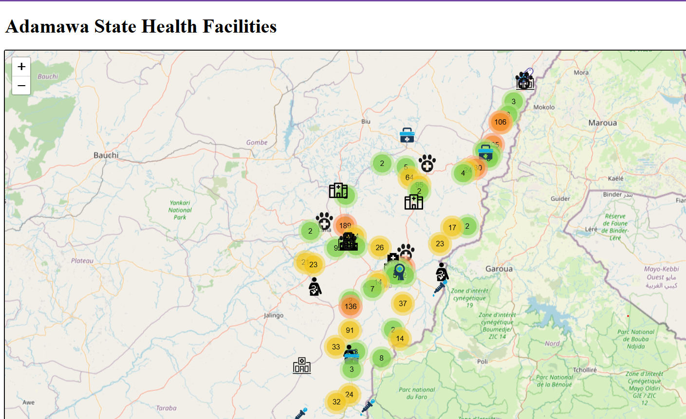
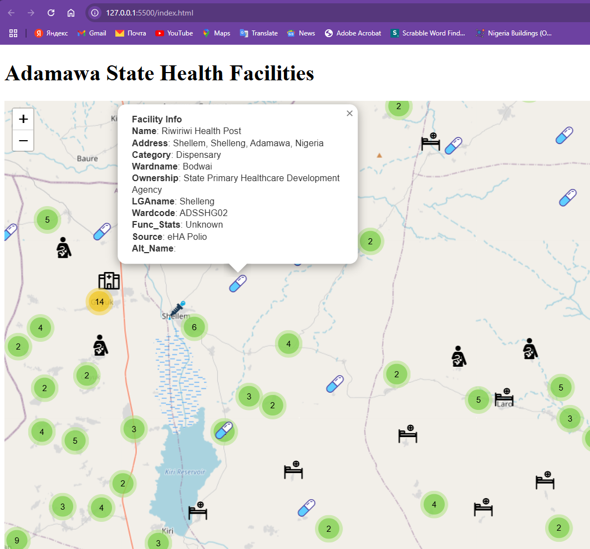

# Adamawa-Hospitals
A Webmap that shows the different types of Medical Centres in Adamawa State

This project is an interactive web map for visualizing health facility locations in Adamawa State, Nigeria. It uses **Leaflet.js**, **Leaflet.markercluster**, and **Leaflet-omnivore** to display CSV and GeoJSON data interactively on an OpenStreetMap basemap.

## 📌 Features

- Display of health facilities categorized by type (e.g. Dispensary, Primary Health Center, General Hospital).
- Custom icons for each health facility type.
- Marker clustering for better visualization when multiple facilities are in close proximity.
- Popups showing detailed information about each facility.

## 📦 Technologies Used

- [Leaflet.js](https://leafletjs.com/)
- [Leaflet.markercluster](https://github.com/Leaflet/Leaflet.markercluster)
- [Leaflet-omnivore](https://github.com/mapbox/leaflet-omnivore)
- [OpenStreetMap](https://www.openstreetmap.org/)

<!-- Alternate method -->
<!--  -->

